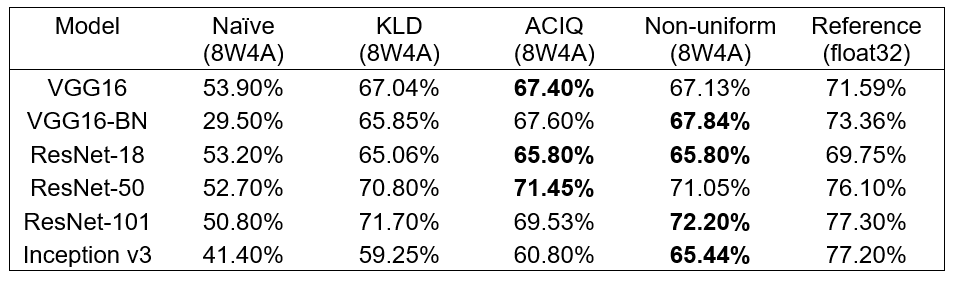
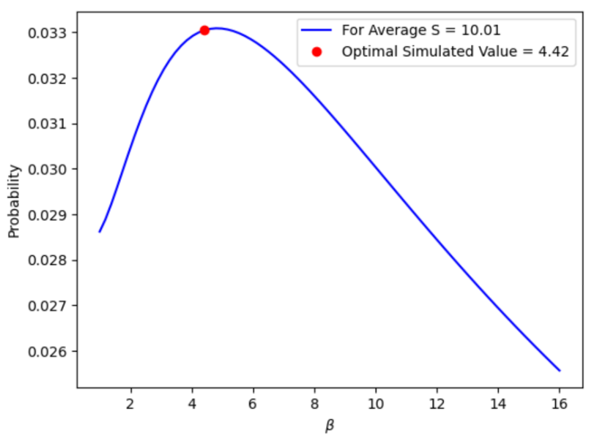

# MLE Quantization of CNNs

We perform non-uniform quantization according to analytical analysis assuming a Laplace distribution. Neural networks quantized by our method show better or comparable performance to other SOTA 4-bit post training quantization methods. 
A more detailed explanation can be found in mle_quantization.pdf

# Requirements
1. python3 (>=3.7)
2. pytorch 1.6
3. torchvision 0.7
4. tqdm 4.49
5. matplotlib 3.2
6. numpy 1.19
7. scipy 1.5

# Data
-   To run this code you need the validation set from ILSVRC2012 data
-   To get the ILSVRC2012 data, you should register on their site for access: [http://www.image-net.org/](http://www.image-net.org/)
- Place the images in the following path: ./imagenet/ILSVRC2012/validation_data/ILSVRC2012_imgs/
- Place the labels text files (those in the data_labels folder) in the following path: ./imagenet/ILSVRC2012/validation_data/ILSVRC2012_labels/
- The torchvision pretrained models have different id classes than the ground truth labels of ILSVRC2012. Check https://github.com/pytorch/vision/issues/484 for more information.

# Quantization Simulation
An experiment can be carried out by running the following command:
```
python test_model.py --model --quantize --w_bits --a_bits
```
- model expects VGG16, VGG16_BN, ResNet18, ResNet50, ResNet101 or Inception_V3.
- quantize is a boolean flag to quantize the model.
- w_bits and a_bits are the number of bits allocated for weights and activations respectively (if quantized). 

# Results
The following table shows the accuracies of all the different deep learning models we tested:

# Running MLE analysis
Run the following command:
```
python mle_analysis.py
```
A similar graph to the one below should be generated. These graphs are created with the hyper parameters suggested in mle_quantization.pdf


